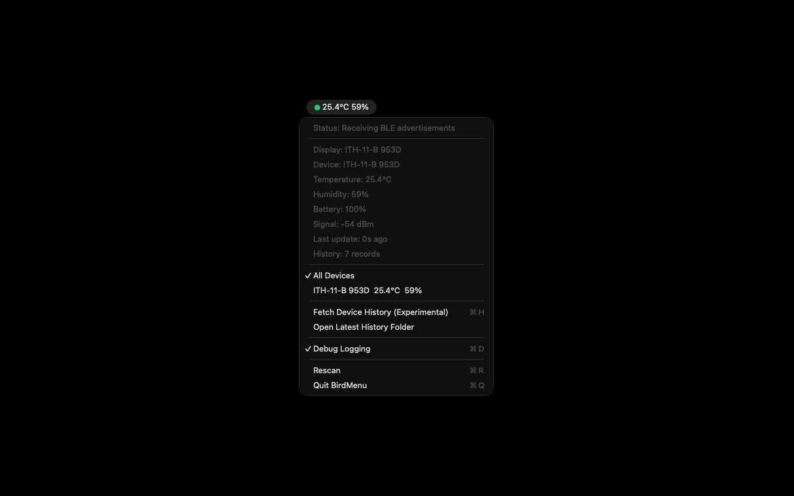

# BirdMenu

BirdMenu is a macOS menu bar app for the waterproof INKBIRD ITH-11-B BLE thermometer/hygrometer.

It listens for the device's BLE advertisements and shows the communication state, temperature, and humidity in the menu bar. The detail menu also shows battery level, RSSI, and the last update time.

When multiple ITH-11-B devices are detected, BirdMenu keeps the latest reading for each device. The menu bar shows the average temperature and humidity by default, and the menu lets you switch the display to a specific device.



## Experimental History Fetch

The menu includes `Fetch Device History (Experimental)`. It connects to the selected ITH-11-B and tries the INKBIRD history-read command pattern used by related BLE hygrometers:

- subscribe to notify characteristics on service `0000fff0-0000-1000-8000-00805f9b34fb`
- write one-byte read commands to `0000fff8-0000-1000-8000-00805f9b34fb`
- never write to the history-delete characteristic `0000fff9-0000-1000-8000-00805f9b34fb`

Some ITH-11-B units do not expose `fff8`; observed devices expose `fff3`, `fff4`, `fff5`, `fff6`, `fff7`, and an additional `5833ff01-9b8b-5191-6142-22a4536ef123` service. In that case BirdMenu saves a read-only GATT snapshot: it discovers all services, reads all readable characteristics, subscribes to notify characteristics, and does not write unknown history commands.

Fetched data is saved under `~/Documents/BirdMenu Logs/`. The app always writes a raw JSON dump. If the packet layout can be decoded confidently, it also writes `history.csv`.

For observed ITH-11-B units, the official-app command sequence appears to return records that have not yet been synced rather than the full retained memory every time. In practice this means repeated fetches may produce only the new records since the previous successful sync. Keep the raw JSON files if you need to audit or re-decode the captured BLE packets later.

This feature is intentionally conservative because the ITH-11-B history protocol is not documented by INKBIRD and is not implemented by `inkbird-ble`.

## Debug Logging

Enable `Debug Logging` from the menu to write received BLE data to macOS Unified Logging. The app logs decoded temperature/humidity/battery/RSSI values, raw advertisement bytes, and experimental history-fetch GATT packets.

View recent logs with:

```sh
log show --style compact --last 10m --predicate 'subsystem == "st.rio.birdmenu"'
```

For live logs:

```sh
log stream --style compact --predicate 'subsystem == "st.rio.birdmenu"'
```

## Official App Trace Analysis

The ITH-11-B offline history protocol is not exposed through `fff8` on observed units. To identify the real sync command, capture an Android Bluetooth HCI snoop log while the official INKBIRD app syncs offline data, then run:

```sh
node Tools/analyze-btsnoop.js /path/to/btsnoop_hci.log
node Tools/analyze-btsnoop.js --summary /path/to/btsnoop_hci.log
node Tools/analyze-btsnoop.js --plan /path/to/btsnoop_hci.log
node Tools/analyze-btsnoop.js --json /path/to/btsnoop_hci.log > trace.json
```

The tool extracts ATT writes, notifications, and indications, including traffic around `fff0` and `5833ff01-9b8b-5191-6142-22a4536ef123`. The output is intended to identify the characteristic and command bytes used by the official app for offline history sync.

`--plan` prints non-CCCD write candidates in the order they appeared, with the response characteristic and sample notification payloads. The JSON output also includes `candidateCommandPlan`, which is the safest starting point for implementing a replay only after the trace clearly shows the official app's history-sync command.

Typical Android capture flow:

1. Enable Developer options on the Android phone.
2. Enable `Bluetooth HCI snoop log`.
3. Force stop the INKBIRD app, then reopen it.
4. Connect to the ITH-11-B and wait until the app finishes syncing offline data.
5. Export the bug report or retrieve `btsnoop_hci.log` from the phone.

The useful lines are usually non-CCCD `write_request` or `write_command` entries followed by `notification` or `indication` packets within a few seconds.

Apple PacketLogger captures from a real iPhone or iPad can also be passed to the same tool. The analyzer reports PacketLogger metadata, interesting advertisements, and whether ATT connection traffic is present. A capture that only contains LE advertising reports is not enough for offline history implementation; it must include the official app's BLE connection writes and notifications during a history sync.

## Build and Run

```sh
make run
```

The app bundle is generated at `build/BirdMenu.app`.

On first launch, macOS may ask for Bluetooth permission. Allow it so the app can receive BLE advertisements.

## BLE Parsing

The ITH-11-B parsing follows `inkbird-ble`:

- model name: `ITH-11-B`
- service UUID: `0000fff0-0000-1000-8000-00805f9b34fb`
- manufacturer id: `9289`
- 18-byte advertisement payload
- temperature/humidity: bytes `[6..<10]`, little-endian signed temperature and unsigned humidity, both in tenths
- battery: byte `[10]`

The app drops impossible humidity values above 100% and battery values above 100%, matching the corruption guards used by `inkbird-ble`.

## Privacy

BirdMenu does not collect, transmit, sell, share, or track personal data. Bluetooth readings and history exports are processed locally on your Mac.

See [Privacy Policy (English)](docs/PRIVACY.en.md) and [プライバシーポリシー (日本語)](docs/PRIVACY.ja.md).

## Acknowledgements

The BLE parsing logic for INKBIRD ITH-11-B advertisements is based on the MIT-licensed [`inkbird-ble`](https://github.com/bluetooth-devices/inkbird-ble) project.

The experimental history-fetch command sequence is informed by public reverse-engineering notes for related INKBIRD BLE hygrometers.

## License

BirdMenu is released under the MIT License. See [LICENSE](LICENSE).
